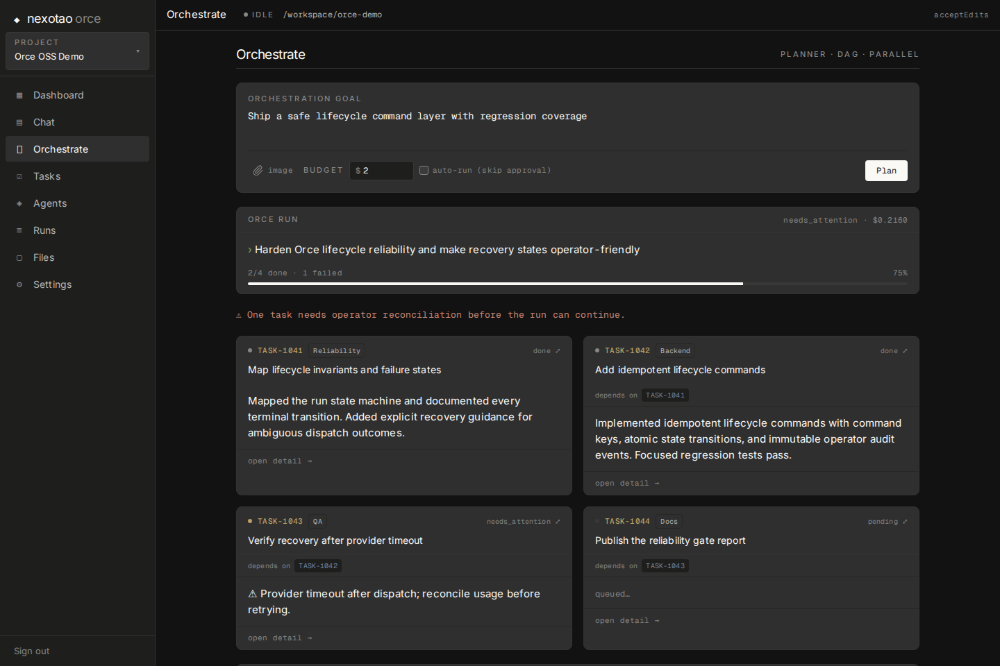
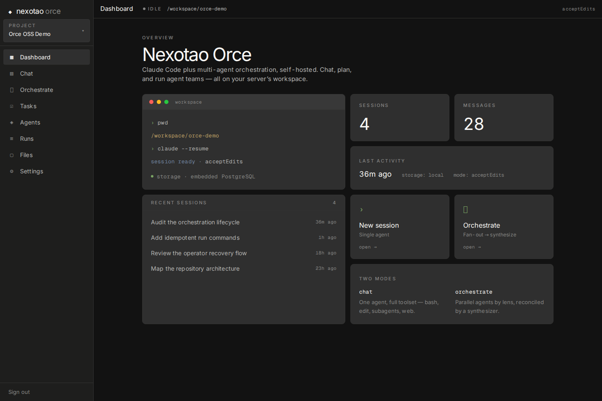
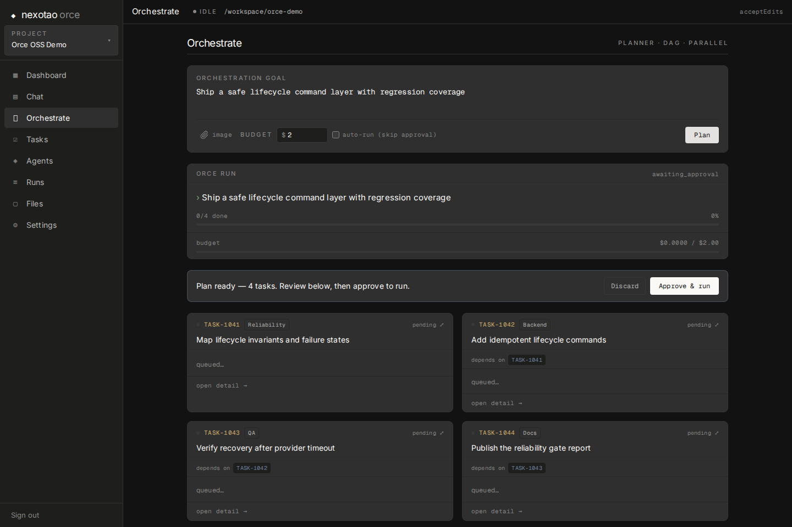
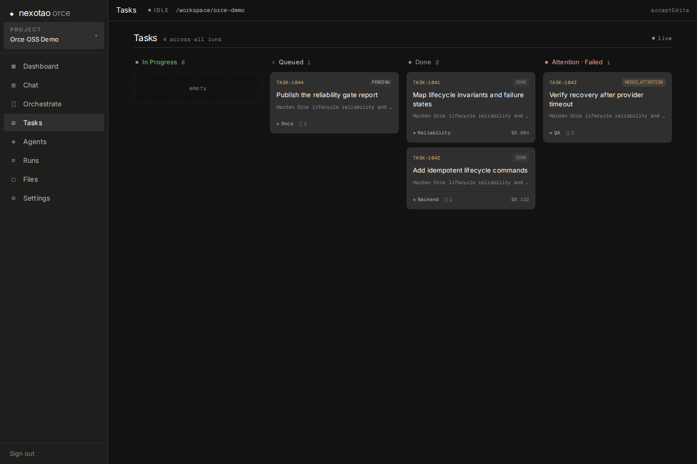
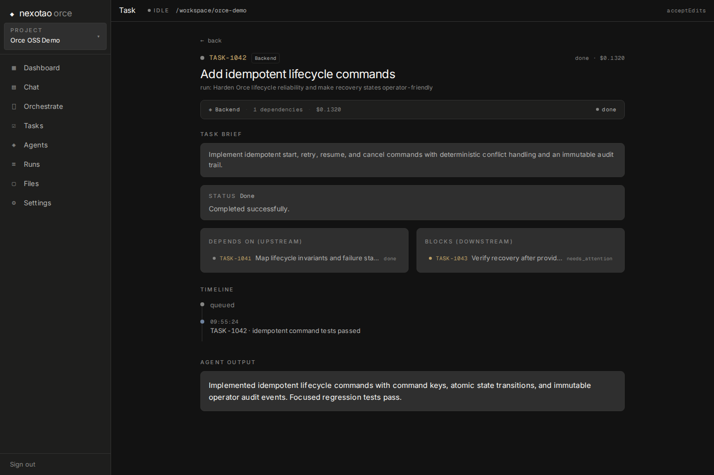
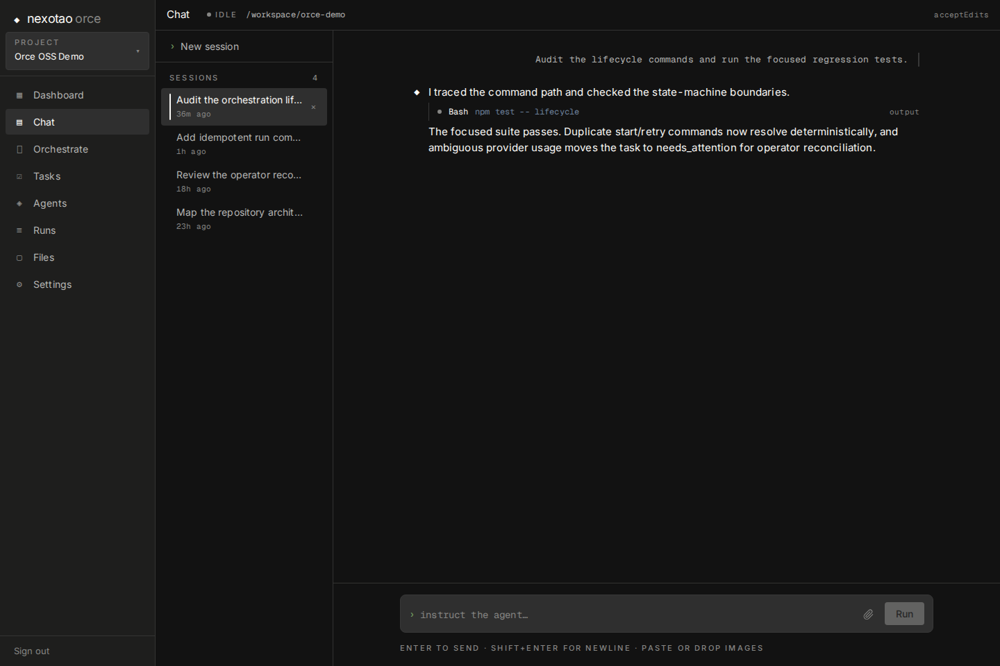
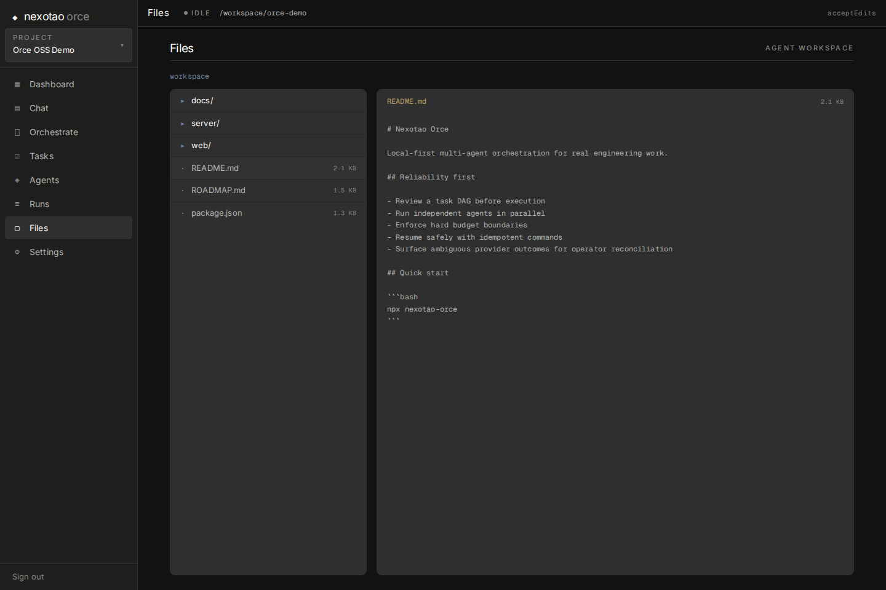

# ◆ Nexotao Orce

**Claude Code, in your browser — plus a real multi-agent orchestration system.**
Self-host it on a VM and drive it from any device: chat with a single agent, or give a goal and watch a **planner break it into a task DAG** that agent teams execute in parallel.

<p align="center">
  
</p>

> If **Claude Code** is one agent at your terminal, **Orce** is a room full of them — planned, tracked, and budgeted from a clean web console.

[](https://www.npmjs.com/package/nexotao-orce)
[](LICENSE)


---

## Why

You love Claude Code but you're tied to a terminal on a machine that has to stay on. Nexotao Orce puts the same engine (the official **Claude Agent SDK**) behind a web UI you host yourself, so you can prompt from your phone, laptop, or tablet — and it adds an orchestration layer for work that's too big for a single agent.

## Features

- 💬 **Chat** — full Claude Code: bash, edit, read, web, subagents. Streaming, with persistent sessions you can resume from any device.
- 🧠 **Orce (orchestration)** — give a goal; a **planner agent** decomposes it into a **task DAG**, assigns each task to the best agent, and a scheduler runs them **in parallel where dependencies allow**.
- 🎫 **Task system** — every task is a ticket (`TASK-0001`), with a global **Tasks** board, status, dependencies, cost, and a **detail page** (status reasoning · connections · timeline · output).
- ✅ **Plan approval** — review the proposed DAG and **Approve & run** (or discard) before anything executes, or leave **auto-run** on (the default) to skip the gate.
- 🤖 **Custom agents** — CRUD agents with their own role, system prompt, model, allowed tools, and optional **isolated workspace** for safe parallel writes.
- 💰 **Budget hard-stop** — set a USD cap per run; warns at 80%, halts new tasks at 100%.
- 📜 **Immutable audit log** — every run keeps a timeline of events.
- 📂 **Multi-project** — an onboarding wizard to **start fresh** (empty workspace + one agent) or **import an existing project** (with a graph build + AI-proposed agents tailored to your stack). Switch between projects; each keeps its own sessions, agents, and runs.
- 📁 **Workspace explorer** — browse and preview the files/projects your agents create.
- 🕸️ **Knowledge-graph aware** — agents get a [graphify](https://pypi.org/project/graphifyy/) tool that maps the project's code (calls, imports, god nodes), so they orient via the graph instead of grepping blindly. Auto-built structurally (no LLM), refreshed each run. Optional — enable with `uv tool install graphifyy --with mcp`.
- 📊 **Bento dashboard** — sessions, cost, storage, recent activity at a glance.
- 🔀 **Two AI providers** — pick at onboarding (or in Settings): **[Nexotao](https://nexotao.com)** (recommended — paste a key, choose a model) or **Claude Code (local)**, which connects straight through the machine's own logged-in Claude Code (subscription, API key, or Bedrock/Vertex/Foundry — nothing to paste).
- ♻️ **Runs in the background** — orchestration runs and chat turns keep executing even if you refresh or close the tab; reopen and they reconnect where they left off.
- 🔌 **Plug & play** — an embedded local Postgres (PGlite) persists everything with **zero setup**. Point at a hosted Neon/Postgres anytime.
- 🔐 **Single-operator auth** — you create the password on first run (nothing printed to the terminal), 🐳 **one-container Docker**, and a **one-command CLI**.

|  |  |
|---|---|
|  |  |
|  |  |
|  |  |

---

## Quick start

You need **Node.js 20+**. Model access is set up in the app — pick **Nexotao** (a key) or **Claude Code (local)** (your machine's own login). See [Choosing a provider](#choosing-a-provider).

### Option 1 — install the `nexotao` command (recommended)

```bash
npm install -g nexotao-orce
nexotao
```

Typing **`nexotao`** starts the server and **opens the UI in your browser**. On first run you **create your own password in the app** (nothing is printed to the terminal), then onboarding walks you through your first project — pick a folder (type a path or **Browse…** it), choose a provider, and go.

- **Stop it:** press **`Ctrl+C`** in the terminal.
- **Forgot your password?** run `nexotao reset-password`, then set a new one on the next launch.
- Custom port: `nexotao --port 9000` · don't auto-open: `nexotao --no-open`
- No global install? Run it once with `npx nexotao-orce`.

### Option 2 — Docker

```bash
git clone https://github.com/rizkyriyadi/nexotao-orchestrator.git && cd nexotao-orchestrator
cp .env.example .env       # set APP_PASSWORD, ANTHROPIC_API_KEY, (optional) DATABASE_URL
docker compose up -d --build
# → http://localhost:8787
```

### Option 3 — from source / development (hot reload)

```bash
npm install
npm run dev:server   # API on :8787  (reads server/.env)
npm run dev:web      # UI on :5173, proxies /api → :8787
```

---

## Choosing a provider

On first run — and anytime under **Settings** — you pick where model access comes from:

- **Nexotao** *(recommended)* — a hosted, Anthropic-compatible gateway. Paste your `sk-nexo-…` key and choose a model (Claude Opus/Sonnet, GPT, Grok, DeepSeek). Grab a key at [nexotao.com](https://nexotao.com) · [docs](https://docs.nexotao.com).
- **Claude Code (local)** — connects directly through the **Claude Code already installed and logged in on this machine**. Nothing to paste and no model to pick — it uses whatever your local `claude` uses (subscription login, `ANTHROPIC_API_KEY`, or Bedrock/Vertex/Foundry). If `claude` works in your terminal, this works. The app auto-detects it and shows **Detected**. Not installed yet? [Install Claude Code](https://docs.claude.com/en/docs/claude-code) and run `claude` to log in.

You can switch providers at any time; the choice is global to your install.

---

## Configuration

Everything is optional — sensible defaults let it run out of the box (embedded storage; you set the password + provider in the app).

| Variable | What it does |
|---|---|
| `APP_PASSWORD` | Web login password. If unset, you **create one in the app** on first run. Reset with `nexotao reset-password`. |
| Provider | Chosen **in the app** (Nexotao or local Claude Code) — no env var needed. |
| `ANTHROPIC_API_KEY` | Optional. Used by the **Claude Code (local)** provider if that's how your machine's `claude` is set up. |
| `DATABASE_URL` | Optional. Empty → an **embedded local Postgres** (PGlite) persists to `~/.nexotao-orce/db` (zero setup). Set it to use a hosted Neon/Postgres. `NEXOTAO_DB=memory` forces ephemeral. |
| `AGENT_CWD` | The agent's working directory (its "project home"). Defaults to a workspace folder. |
| `PERMISSION_MODE` | `bypassPermissions` (default — "auto mode", agents don't stall on prompts) · `acceptEdits` · `default` · `plan`. |
| `ORCE_PLAN_MAX_NODES` | Maximum planner DAG size. Default `32`; invalid output is retried once and then fails visibly. |
| `ORCE_PLAN_MAX_DEPTH` | Maximum dependency-path depth. Default `8`. |
| `PORT` | Default `8787`. |
| `NEXOTAO_DATA` | Where the CLI stores secrets + workspace (default `~/.nexotao-orce`). |

Free persistent storage: create a project at [neon.tech](https://neon.tech) and paste its connection string into `DATABASE_URL`.

---

## How it works

- **`server/`** — Node + [Hono](https://hono.dev). Wraps `@anthropic-ai/claude-agent-sdk`, normalizes its stream into small SSE events, and adds the Orce engine (planner → DAG scheduler), auth, and a Neon/Postgres (or in-memory) store. Serves the built UI, so it's a single process on one port.
- **`web/`** — React + Vite + Tailwind. Streaming chat, the orchestration board, task pages, agents, files, and dashboard.
- **Orce engine** — `planPhase` validates task shape, exact agent names, unique keys, dependencies, graph size/depth, and acyclicity before persistence. Invalid model output gets one structured correction retry and then fails visibly. `executePhase` revalidates persisted plans, runs ready tasks in deterministic order, and terminates any no-ready-task state instead of waiting silently.

## ⚠️ Security

This server can **run shell commands and edit files** on its host. Treat it like SSH:

- Always put it behind **HTTPS** (e.g. [Caddy](https://caddyserver.com): `reverse_proxy localhost:8787`). Never expose the raw port.
- Use a **strong password** (you set it on first run). It's single-operator by design — don't share it.
- It defaults to **`bypassPermissions`** ("auto") so agents run unattended without prompts. Set `PERMISSION_MODE=acceptEdits` for a stricter setup, and lock the VM firewall to your IP either way.

## Roadmap

Reliability comes before feature breadth. Read the [public roadmap](ROADMAP.md), [core lifecycle invariants](docs/invariants.md), [failure matrix](docs/failure-matrix.md), and [measured baseline](docs/baseline.md). Remaining restart, isolation, and hard-budget limitations are stated there explicitly.

## Local diagnostics

Orce sends no telemetry. An authenticated operator may explicitly download an aggregate local report from `/api/diagnostics/export`. It covers install, onboarding, first plan, first successful run, seven-day return usage, and run outcomes without prompts, paths, source content, or secrets. See [the data contract](docs/diagnostics.md).

## Contributing

Issues and PRs welcome — see [CONTRIBUTING.md](CONTRIBUTING.md), [SECURITY.md](SECURITY.md), and [CODE_OF_CONDUCT.md](CODE_OF_CONDUCT.md).

## License

[MIT](LICENSE) © Rizky Riyadi.

Built on the [Claude Agent SDK](https://www.npmjs.com/package/@anthropic-ai/claude-agent-sdk). Not affiliated with Anthropic.
